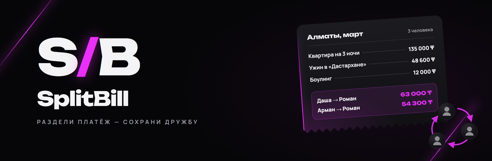
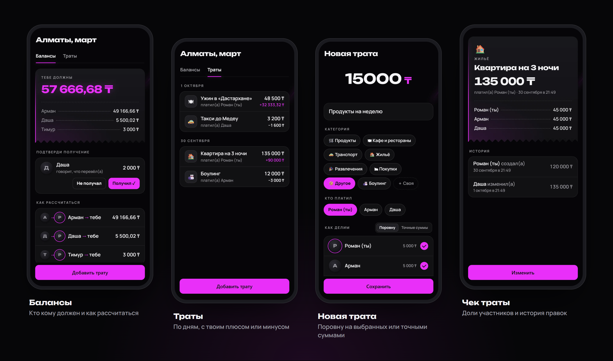
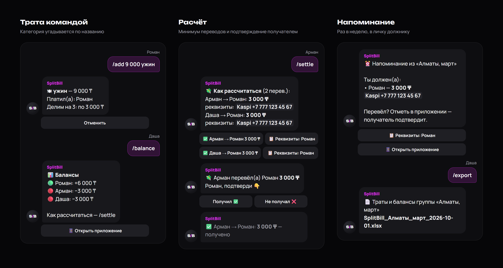
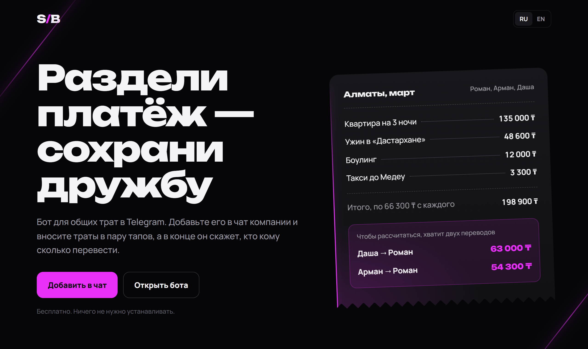
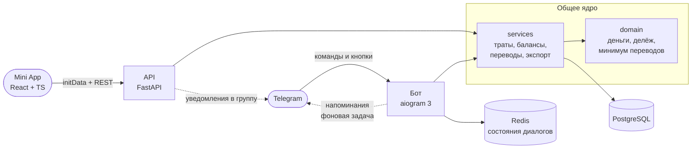
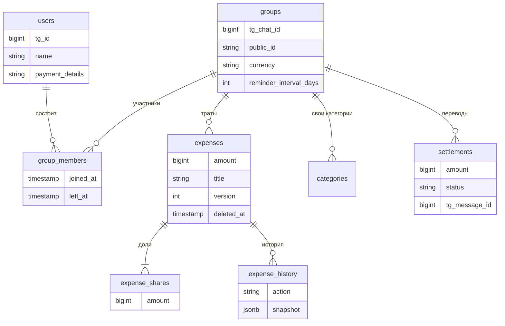

<p align="center">
  
</p>

<p align="center">
  <b>Общие траты компании прямо в Telegram.</b><br />
  Вносите траты в чате — в конце бот скажет, кто кому сколько перевести, и проследит, чтобы все рассчитались.
</p>

<p align="center">
  <a href="https://t.me/splitbill66bot"></a>
  <a href="https://lazyyy66.github.io/split-bill/"></a>
  <a href="https://github.com/lazyyy66/split-bill/actions/workflows/ci.yml"></a>
</p>

<p align="center">
  
  
  
  
  
  
  
  
  <a href="LICENSE"></a>
</p>

---

## Зачем это

Компания едет в поездку, идёт в кафе, снимает квартиру. Платят разные люди, а в конце никто не помнит, кто кому
сколько должен. Splitwise и Tricount решают задачу, но их нужно ставить и в них нужно регистрироваться — всем.

**SplitBill живёт там, где компания и так общается — в групповом чате Telegram.** Добавили бота, нажали «Я в деле»,
вносите траты командой или в приложении внутри Telegram. В конце бот сводит все долги к минимуму переводов, показывает
номер получателя с кнопкой «Скопировать» и закрывает долг, когда получатель подтвердит перевод.

## Как это выглядит

### Приложение внутри Telegram

<p align="center">
  
</p>

Mini App открывается кнопкой «📱 Открыть приложение» прямо из чата группы. Тёмная тема в цветах бренда, нативные
кнопки Telegram, русский и английский. Ещё больше экранов — в [`docs/images/screens`](docs/images/screens).

### Бот в чате

<p align="center">
  
</p>

<sub>Иллюстрация: настоящие тексты сообщений бота из <code>app/bot/texts.py</code> в фирменном оформлении.</sub>

### Лендинг

<p align="center">
  <a href="https://lazyyy66.github.io/split-bill/"></a>
</p>

## Что умеет

| | |
|---|---|
| 🙋 **Ничего не нужно устанавливать** | Всё в Telegram: бот в группе и Mini App внутри него. Регистрация — одна кнопка «Я в деле». |
| ➗ **Гибкий делёж** | Поровну на всех, поровну на выбранных или точными суммами. Остаток от деления (1000 ₸ на троих) — по одной единице, начиная с плательщика. |
| 💸 **Минимум переводов** | Десяток взаимных долгов превращается в два-три перевода на всю компанию. |
| 📋 **Номер в один тап** | Каждый указывает, куда ему переводить: «📱 Взять номер из профиля» Telegram или ввести вручную, если карта на другом номере. |
| ✅ **Подтверждение получения** | Должник жмёт «Я перевёл», получатель — «Получил». Можно отдавать частями. Двойное нажатие не создаст дубль. |
| ⏰ **Напоминания** | Раз в неделю (или раз в 3 дня) бот пишет должнику в личку. Кому написать нельзя — одной сводкой в группу. |
| 📄 **Таблица Excel** | Траты с долей каждого, балансы, план расчёта и история переводов — бот присылает `.xlsx` в личку. |
| ✏️ **История изменений** | Трату может поправить любой участник, но каждая правка сохраняется: кто, когда, что было. |
| 🗂 **Категории** | Угадываются по названию («такси» → 🚕), можно завести свои. |
| 🚪 **Вышедшие участники** | Кто вышел из чата, остаётся в расчётах до погашения долга, но в новые траты не попадает. |
| 🌍 **Русский и английский** | Язык подхватывается из Telegram, меняется командой `/lang`. |

## Команды бота

| Команда | Где | Что делает |
|---|---|---|
| `/start` | группа | Приветствие, кнопки «Я в деле 🙋», «📱 Открыть приложение», «💳 Мой номер» |
| `/add 12 000 ужин` | группа | Трата поровну на всех участников; сумму можно с пробелами и копейками |
| `/balance` | группа | Кто сколько должен |
| `/settle` | группа | Минимальный план переводов с кнопками «Я перевёл» и «Скопировать реквизиты» |
| `/paid 3000 @user` | группа | Отметить перевод, в том числе частичный (или ответом на сообщение получателя) |
| `/export` | группа | Таблица Excel со всеми тратами — в личку |
| `/setpay` | личка / группа | Номер для переводов: из профиля Telegram или вручную |
| `/lang ru` / `/lang en` | везде | Язык группы или личного чата |

## Архитектура



Бот и API — тонкие слои поверх общих сервисов: одна и та же логика трат, балансов и переводов работает и для команд в
чате, и для Mini App. Всё, что человек делает в приложении, бот дублирует сообщением в группе — чтобы компания видела
изменения там, где общается.

### Модель данных



## Интересные решения

<details open>
<summary><b>Минимум переводов</b></summary>

Для каждого считается чистый баланс: *заплатил − его доли + отправил − получил*. Дальше жадно: крупнейший должник
платит крупнейшему кредитору, пока все балансы не станут нулём. Это даёт не больше *n − 1* переводов (найти строгий
минимум — NP-трудная задача, поэтому жадный подход — разумный компромисс). При равных суммах порядок определяется id,
поэтому результат детерминирован.

```text
Поездка: квартира 135 000, ужин 48 600, боулинг 12 000, такси 3 300 — на троих, по 66 300.
Заплатили: Роман 183 600, Арман 12 000, Даша 3 300.
Балансы:   Роман +117 300, Арман −54 300, Даша −63 000.
Переводы:  Даша → Роман 63 000, Арман → Роман 54 300. Всего два.
```

Алгоритм — чистая функция без БД и Telegram ([`app/domain/settlement.py`](app/domain/settlement.py)), покрыт
223 тестами, из них 200 — случайные наборы долгов: после переводов все балансы должны обнулиться, переводов не больше
*n − 1*, платят только должники и только кредиторам.
</details>

<details>
<summary><b>Деньги — только целые числа</b></summary>

Все суммы хранятся в минимальных единицах (тиынах) как `BIGINT`, никаких `float`. Деление с остатком раскладывает лишние
тиыны по одному, начиная с плательщика, — сумма долей всегда точно равна сумме траты. Парсер понимает `12000`,
`12 000`, `1 500 000,50`, но `/add 500 2 пиццы` — это 500 ₸ и «2 пиццы». Логика продублирована на фронте
([`webapp/src/money.ts`](webapp/src/money.ts)), чтобы превью долей в форме совпадало с тем, что посчитает сервер.
</details>

<details>
<summary><b>Безопасность Mini App</b></summary>

- Каждый запрос к API подписан Telegram: заголовок `Authorization: tma <initData>`, подпись проверяется HMAC-SHA256 с
  ключом, производным от токена бота ([`app/api/init_data.py`](app/api/init_data.py)). `user_id` берётся только
  оттуда — никогда из тела запроса.
- Ссылка на группу содержит случайный `public_id` (72 бита), а не порядковый номер — чужие группы не перебрать.
- Ссылку могли переслать постороннему, поэтому вступление через Mini App проверяется вызовом `getChatMember`: человек
  должен реально состоять в чате.
- Бот не читает переписку: в группах включён privacy mode, Telegram передаёт только команды.
</details>

<details>
<summary><b>Одновременные правки и двойные нажатия</b></summary>

- **Оптимистичная блокировка:** у траты есть `version`. Если двое открыли одну трату и сохранили по очереди, второй
  получит «кто-то изменил это одновременно с тобой», а не молча затрёт чужую правку.
- **Подтверждение перевода** берёт строку с `SELECT … FOR UPDATE` — двойной клик по «Получил» не засчитает перевод
  дважды.
- **Устаревшие кнопки:** если после `/settle` добавили новые траты, старая кнопка «Я перевёл» откажется работать и
  попросит вызвать `/settle` заново.
</details>

<details>
<summary><b>Напоминания без дублей</b></summary>

Фоновая задача в процессе бота раз в 10 минут проверяет, не наступил ли час напоминаний (19:00 по Алматы). Группы, которым
пора, «забираются» одним атомарным `UPDATE … RETURNING`, и отметка коммитится *до* рассылки: даже если рассылка упадёт
посередине или запущено два экземпляра бота, никто не получит напоминание дважды. Бот не может первым написать человеку,
который не открывал с ним личку, — таких собираем в одну сводку в группе. Переводы, которые уже отмечены и ждут
подтверждения, не напоминаются.

> Изначально в плане был arq, но он не работает на Python 3.14 (использует удалённое поведение asyncio), поэтому
> напоминания сделаны без лишней зависимости.
</details>

<details>
<summary><b>Эмулятор Telegram для e2e-тестов</b></summary>

Чтобы проверять сценарии «как в жизни» без живых аккаунтов, в тестах подменён только сетевой слой aiogram
([`tests/integration/tg.py`](tests/integration/tg.py)). «Роман», «Арман» и «Даша» пишут команды, жмут inline-кнопки,
делятся контактом — апдейты идут через настоящий Dispatcher, middleware, хендлеры и Postgres. Эмулятор ведёт себя как
Telegram: например, бот не может первым написать в личку тому, кто её не открывал.

```python
async def test_full_flow_add_balance_settle_confirm(tg, trip):
    chat, roman, arman, dasha = trip
    await roman.send(chat, "/add 9000 ужин в ресторане")
    [settle] = await roman.send(chat, "/settle")

    result = await dasha.click(settle, "Арман → Роман")  # чужая кнопка
    assert result.alert == "Эту кнопку жмёт тот, кто переводит"

    [request] = (await arman.click(settle, "Арман → Роман")).messages
    result = await roman.click(request, "Получил")
    assert "получено" in result.messages[0].text
```

Эмулятор нашёл настоящий баг ещё до первых пользователей: `/add 12 000 продукты` записывал трату на 12 ₸ с названием
«000 продукты».
</details>

## Тесты и CI

**345 тестов**, все гоняются на настоящем PostgreSQL:

| Что | Тестов |
|---|---|
| Алгоритм расчёта, деньги, категории, телефоны, подпись initData | 289 |
| Сервисы на Postgres (балансы, переводы, выход из группы) | 9 |
| E2E-сценарии бота через эмулятор Telegram | 16 |
| API Mini App | 19 |
| Напоминания | 8 |
| Экспорт в Excel (содержимое листов и доставка) | 4 |

[GitHub Actions](.github/workflows/ci.yml) на каждый push и pull request: `ruff`, миграции на чистой базе +
`alembic check` (модели и миграции совпадают), все тесты; для Mini App — проверка типов и сборка. Лендинг
публикуется на GitHub Pages [отдельным workflow](.github/workflows/pages.yml).

## Стек

| | |
|---|---|
| **Бэкенд** | Python 3.14, aiogram 3, FastAPI, SQLAlchemy 2 (async), Alembic, Pydantic, openpyxl |
| **Хранилища** | PostgreSQL 17, Redis (состояния диалогов бота) |
| **Mini App** | React 19, TypeScript, Vite, без UI-библиотек; `telegram-web-app.js` |
| **Инструменты** | uv, ruff, pytest + pytest-asyncio, Playwright (скриншоты), Docker Compose, GitHub Actions |

## Структура проекта

```text
app/
├── domain/        чистая логика без БД и Telegram: деньги, делёж, минимум переводов, категории
├── services/      работа с БД: группы, траты, балансы и переводы, экспорт в Excel
├── bot/           aiogram: хендлеры, клавиатуры, тексты ru/en, уведомления, напоминания
├── api/           FastAPI для Mini App: проверка initData, эндпоинты, схемы
└── db/            модели SQLAlchemy
migrations/        Alembic
tests/             unit-тесты + integration/ (Postgres, эмулятор Telegram, API)
webapp/            Mini App: React + TypeScript + Vite
landing/           лендинг и политика конфиденциальности (GitHub Pages)
docs/images/       картинки для README и их HTML-исходники
```

## Запуск локально

Нужны [uv](https://docs.astral.sh/uv/), [Docker](https://www.docker.com/), Node.js 24 и бот от
[@BotFather](https://t.me/BotFather). Для Mini App — HTTPS-туннель (например, ngrok со статичным доменом).

```bash
git clone https://github.com/lazyyy66/split-bill.git && cd split-bill
cp .env.example .env               # впишите BOT_TOKEN и остальное
uv sync                            # Python 3.14 и зависимости
cd webapp && npm install && cd ..
docker compose up -d db redis      # PostgreSQL + Redis
uv run alembic upgrade head        # миграции
```

Дальше четыре процесса — или всё сразу одной командой `.\dev.ps1` на Windows:

```bash
uv run python -m app.bot                                              # бот (polling)
uv run uvicorn app.api.main:create_app --factory --reload --port 8000 # API, документация на /api/docs
cd webapp && npm run dev                                              # Mini App на :5173
ngrok http 5173 --url=<ваш-домен>                                     # HTTPS для Telegram
```

| Переменная | Зачем | По умолчанию |
|---|---|---|
| `BOT_TOKEN` | токен бота от @BotFather | — |
| `WEBAPP_SHORT_NAME` | короткое имя Mini App из `/newapp` — для кнопки «Открыть приложение» | нет кнопки |
| `NGROK_DOMAIN` | статичный домен для `dev.ps1` | — |
| `DATABASE_URL` | PostgreSQL | `localhost:5432/splitbill` |
| `REDIS_URL` | Redis | `localhost:6379/0` |
| `TIMEZONE` | часовой пояс напоминаний и дат в экспорте | `Asia/Almaty` |
| `REMINDER_HOUR` | час напоминаний | `19` |

Полезное:

```bash
uv run pytest                          # все тесты (интеграционные — на базе splitbill_test)
uv run ruff check . && uv run ruff format .
uv run python -m app.bot.reminders     # разослать напоминания прямо сейчас
cd webapp && npm run dev -- --port 5174   # затем в другом окне:
cd webapp && npm run screenshots          # скриншоты всех экранов Mini App (Playwright + тестовые данные)
cd webapp && node scripts/readme-images.mjs   # пересобрать картинки для README
```

## Дальше

- [x] Бот: траты, балансы, минимум переводов, подтверждение, реквизиты
- [x] Mini App: балансы, траты, форма, история, свои категории
- [x] Напоминания должникам, экспорт в Excel
- [x] Лендинг, политика конфиденциальности, CI
- [ ] Деплой на VPS: webhook, HTTPS через Caddy, бэкапы базы, мониторинг ошибок
- [ ] Удаление своих данных по кнопке
- [ ] Идеи: inline-режим `@splitbill66bot 5000 такси`, мультивалютность, повторяющиеся траты

## Лицензия

[MIT](LICENSE) — можно использовать, менять и распространять код, в том числе в коммерческих проектах, с указанием
автора.

## Автор

**Роман** — Python-бэкенд. Проект сделан как продукт для реальных компаний друзей и как работа для портфолио.

<p align="center"><sub>S<b>/</b>B — раздели платёж, сохрани дружбу</sub></p>
